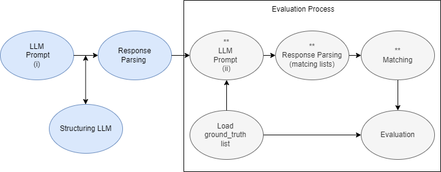

This work have been done for EU KLEPTOTRACE project!

Here we see the methodology used! More on the paper!

At Main (KleptoDataset.py),  we can run 4 experiments by uncommenting the desired one!
1) Individual Identification experiment 
2) Organization Identification experiment
3) Individual Identification experiment on SpaCy (for comparison)
4) Organization Identification experiment on SpaCy (fo comparison)

The used dataset( change load_data() ): 

Environment: to create a conda environment run the follow commands
1) conda create --name kleptotrace python=3.9
2) conda activate kleptotrace
3) pip install -r requirements.txt

Download Ollama: https://ollama.com/

Download models from Ollama: 
1) ollama pull gemma2:9b
2) ollama pull qwen2:7b 

Run:
1) python KleptoDataset.py

